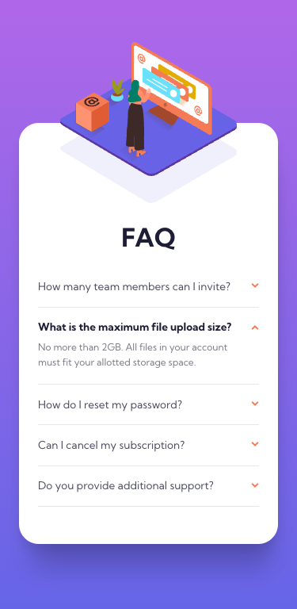

# Frontend Mentor - FAQ accordion card solution

This is Max Ruuen's solution to the [FAQ accordion card challenge on Frontend Mentor](https://www.frontendmentor.io/challenges/faq-accordion-card-XlyjD0Oam). Frontend Mentor challenges help you improve your coding skills by building realistic projects.

## Table of contents

- [Overview](#overview)
  - [The challenge](#the-challenge)
  - [Screenshot](#screenshot)
  - [Links](#links)
- [My process](#my-process)
  - [Built with](#built-with)
  - [What I learned](#what-i-learned)
- [Author](#author)

## Overview

### The challenge

Users should be able to:

- View the optimal layout for the component depending on their device's screen size
- See hover states for all interactive elements on the page
- Hide/Show the answer to a question when the question is clicked

### Screenshot

#### Desktop Layout

#### Mobile Layout

### Links

- Solution URL: [Frontend Mentor](https://www.frontendmentor.io/challenges/faq-accordion-card-XlyjD0Oam/hub/faq-accordion-card-challenge-with-scss-g8NDUoy8V)
- Live Site URL: [Netlify](https://rd-challenge-faq-accordion.netlify.app/)

## My process

### Built with

- HTML / CSS
- SASS
- SVG

### What I learned

I learned about the :target selectors in CSS but have not refactored my code to implement them for a JS-only solution at this point. I will revisit this shortly and adjust using the knowledge I learned while researching.

I still need to practice more CSS background image positioning for more confidence, but overall this was a fun and relatively quick challenge to complete.

## Author

- Frontend Mentor - [@ruuendigital](https://www.frontendmentor.io/profile/ruuendigital)
- Twitter - [@maxruuen](https://www.twitter.com/maxruuen)
